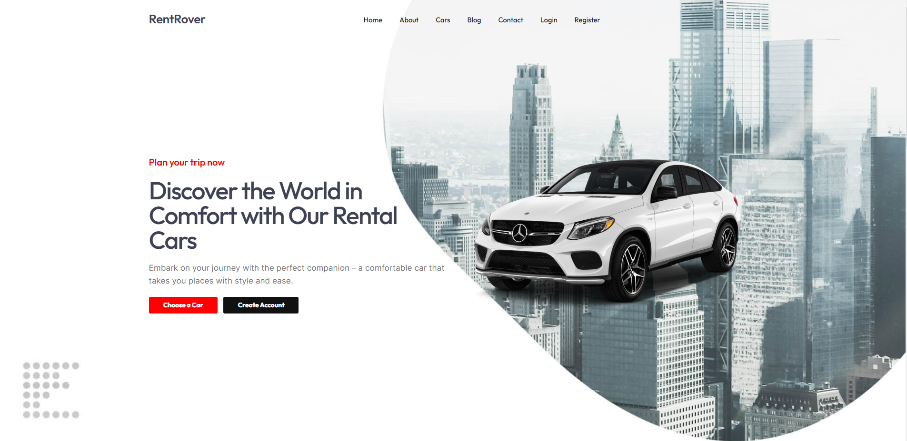

# RentRover

## Description

Rent a car web application. Created with Vue.js, Vue Router, Express.js and MongoDB.

## Roles

1. Guest,
2. User,
3. Admin

## Functionality

Authorization (with JWT):

1. Register,
2. Login,
3. Logout

When you are not authorized you can:

1. Order car of your choice,
2. Send email

When you are authorized as User you can:

1. Order car of your choice,
2. Track your orders,
3. Cancel order,
4. Send email,
5. Leave a comment on the blog,
6. Delete your comment

When you are authorized as Admin you can:

1. Users - list, get details, update (change user role to Admin, among other things) and delete,
2. Categories - create, list, get details, update, delete,
3. Brands - create, list, get details, update, delete,
4. Cars - create, list, get details, update, delete,
5. Blogs - create, list, get details, update, delete

## Demo

You can check my application [here](https://rent-rover-app.onrender.com/).

## Index page

